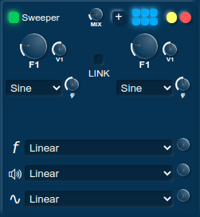

# shifter

This was my thesis project. It is a program for creating and modifying sounds via filters and generators, which can be applied both in the time and frequency domains.

Most everything here was hand-rolled, save for the one dependency on node-wav and the fft implementation, which I shamelessly stole from somewhere. In my defence, I was a kid, and I was pretty late with my thesis :P

It uses nwjs, although the build scripts/dependencies do not reflect that for some reason.

Some screenshots I found from back then:

